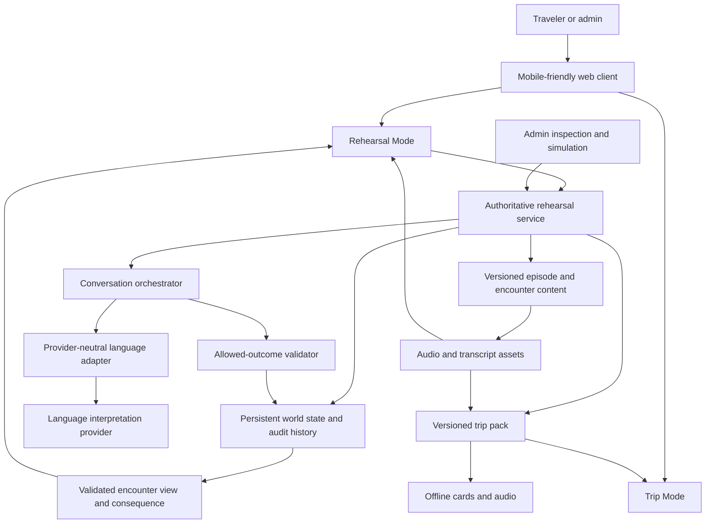

# Technical Plan

This plan now supports the lifecycle defined in [`PRODUCT_DIRECTION.md`](PRODUCT_DIRECTION.md): guided Rehearsal Mode before departure and a separate offline-friendly Trip Mode backed by a portable trip pack.

## Recommendation

Use a **staged approach beginning with a mobile-friendly web application**, then add only the PWA capabilities that improve the validated experience. Keep a native Swift client as a later option behind stable service and content boundaries.

For a production-quality first slice, use one responsive web client with two modes, a small authoritative application service, durable relational state, reviewed session content, a provider-isolated language interpretation boundary, and a portable trip-pack contract. The player listens and types; do not build two clients, full offline rehearsal mutation, player speech or microphone input, push notifications, or an unconstrained generative world.

The private validation build in [`../web/`](../web/) has one exact 31-session manifest and registry, stable episode-ID persistence with migration from the four-scene v1 save, countdown scheduling, generated Admin fast-track checkpoints, generalized episode evidence, a 30-card Pocket Deck, and a derived offline inventory. It deliberately uses device-local state and deterministic bounded intent handling so the user can evaluate the interaction before a production service or provider boundary is justified.

The registry—not an array index—is runtime and persistence authority. `sceneIndex` is absent from current game state and accepted only at the legacy-save migration boundary. Each current episode owns its content, evaluator, evidence extractor, mutations, and Admin seed in an independent module; the generic coordinator has no day-specific branches. Unsupported or missing season metadata fails during registry construction instead of producing a placeholder session.

## Delivery approach comparison

| Approach | Strengths for this product | Costs and risks | Recommendation |
|---|---|---|---|
| Mobile-friendly web app / PWA | Fast iteration; works on phone and desktop; easy private distribution; responsive text/audio UI; admin tools can share the stack; installation and limited caching can be added later | Browser audio policies and background behavior vary; robust offline writes and notifications are harder; native speech/audio features may eventually be constrained | **Start here.** Initially validate as a mobile-friendly web app; add installability/caching only when they solve observed needs |
| Native Swift application | Strong Apple-platform audio, accessibility, notification, background, secure storage, and offline options; polished personal-device experience | Slower product iteration; separate admin surface likely; Apple-only; premature native work may optimize an unproven loop | Reconsider after the personal pilot if native audio, offline, or reminders are material blockers |
| Staged / hybrid | Preserves fast validation while keeping service/content contracts client-neutral; can later wrap, replace, or complement the web client | Requires disciplined boundaries and can tempt maintenance of two clients | **Overall strategy.** One web client now, not simultaneous hybrid implementation; stable contracts make a later native client possible |

### Native reconsideration triggers

Revisit Swift only if evidence from the seven-day or 30-day personal run shows one or more of these are central:

- reliable offline episodes with queued, conflict-safe state changes;
- local or advanced audio processing unavailable or fragile in the browser;
- notifications essential to the one-episode-per-day rhythm;
- background audio or lock-screen behavior central to use;
- system-level accessibility or on-device privacy requirements unmet by the web client; or
- sustained use that justifies the cost of an Apple-only presentation layer.

A desire for visual polish alone is not sufficient to maintain two product surfaces.

## Conceptual architecture

The provider returns a proposal; the allowed-outcome validator and state service hold authority. NPC output shown after a mutation describes the committed result, never an uncommitted guess.

For the current local prototype, the client, rule layer, and save are bundled in one browser application. This is a temporary validation shape, not a change to the production authority boundary above.

## Client experiences

The mode boundary is behavioral, not just navigation.

### Rehearsal Mode

The player surface needs:

- objective, place/time context, and only the world facts the player should know;
- audio-first NPC turns with clear play/replay state;
- careful-speed replay and transcript reveal throughout the season, with prominence adapted to evidence;
- typed response entry that does not imply perfect sentences are required;
- explicit alternatives for clarification, support, and leaving;
- a clear distinction between required repair and optional continuation;
- concise correction and consequence display;
- save/resume and day-availability state; and
- accessibility settings independent from adaptive learning support.

The admin surface may share client components but is a separate mode with conspicuous non-canonical state, episode/state selectors, interpretation and rule traces, audio inspection, restart, and synthetic-state controls.

The first client should favor a single focused interaction over a dashboard. The core usability question is whether audio → support if needed → typed intent → believable consequence feels like life rather than a quiz.

### Trip Mode

Trip Mode needs a compact deck home, pinned/recent cards, large categories, bounded English intent search, normal/careful audio, large-text show view, local notes, and visible offline readiness. It must omit lesson framing, correction, scores, and simulated world consequences.

The first slice may use browser storage and existing local audio to validate the experience, but source data should already follow the portable trip-pack boundary in [`TRIP_MODE_AND_POCKET_DECK.md`](TRIP_MODE_AND_POCKET_DECK.md).

## Persistent game-state service

The application service is authoritative even for a single initial player. It owns:

- canonical timeline and episode/day availability;
- atomic application of money, time, location, inventory, reservation, relationship, memory, and commitment effects;
- save snapshots and an append-only audit of applied outcomes;
- concurrency/idempotency protection so retries cannot double-charge or duplicate an item;
- canonical versus practice/admin run separation;
- state-version checks before applying an interpretation; and
- reconciliation of open obligations at episode and season boundaries.

A relational persistence model is a reasonable provisional fit because transactions, commitments, and cross-references matter. Exact database and hosting choices are deferred. In the current private prototype, a deterministic reducer applies bounded outcomes atomically and `localStorage` preserves the single-device snapshot; a remote canonical run will require the service described above.

## Content and episode system

Content is versioned, reviewed data interpreted by the application, not executable code authored episode by episode. It defines objectives, beats, NPC constraints, line variants, intents, required slots, ambiguity rules, allowed outcomes, support, corrections, dependencies, callbacks, and evaluator cases.

Content versioning matters because saves and audit events must retain the version that produced them. A published episode version should be immutable for an active canonical run; fixes create an explicit migration or a new version rather than silently changing history.

The first slice needs a simple internal authoring representation and inspection view, not a generalized visual authoring platform.

## Conversation orchestration

The orchestrator assembles only the context required for the current turn:

- NPC role and permitted knowledge;
- immediate practical beat;
- allowed player intents and essential details;
- relevant canonical facts and selected character memories;
- prohibited inventions and required exit behavior;
- learner evidence relevant to support/correction; and
- content/output version identifiers.

It requests structured interpretation: proposed communicative intent, extracted details, confidence, ambiguity, Spanish/English crossover signals, and at most one correction candidate. It must not ask the provider to decide the actual state transition.

For constrained, predictable inputs, local deterministic recognition can resolve explicit interface actions and exact common fragments before any model call. This reduces cost and latency but must not turn natural typed language into phrase matching.

## Intent interpretation and bounded outcomes

The turn boundary follows a fail-closed sequence:

1. Receive the typed response with the encounter and state version.
2. Detect explicit interface actions such as leave or request replay without model interpretation.
3. Ask the language adapter for an interpretation proposal when needed.
4. Validate that the proposed intent is allowed in the current beat.
5. Validate essential details, confidence, current availability, funds, and state version.
6. Select one authored clarification if consequential information is uncertain.
7. Apply one allowed outcome atomically when requirements are satisfied.
8. Render an NPC response and correction grounded in the committed outcome.
9. Record a privacy-conscious audit event.

Examples:

- The model may infer that `Un chair, non due` means one chair. The game must still check that a one-chair rental is allowed, available, priced, affordable, and confirmed before charging.
- The model may infer that the player says the ferry was cancelled. Character memory can adopt that claim only if canonical transport state supports it or the content explicitly permits an unverified belief.
- Low confidence about `fifteen` versus `fifty` or one versus two requires confirmation before a transaction.

## Model/provider isolation

All provider-specific calls sit behind a narrow adapter. The rest of the system depends on the project’s own interpretation concepts, error classes, version metadata, and latency/cost measurements.

This allows the project to:

- compare providers and models with the same evaluator set;
- use different services for interpretation and audio without coupling game rules;
- replace a provider without rewriting content or saves;
- set timeouts, retries, and privacy settings consistently; and
- pin behavior for a canonical content run where possible.

No provider is selected in this phase. A provider decision requires current official documentation, measured Italian performance on the project’s response corpus, latency/cost results, data-retention review, and acceptable contractual terms.

## Audio generation and playback

### First-slice strategy

Use a small set of reviewed, pre-produced NPC lines with exact transcripts, normal and selected careful-speed variants, and controlled ambient layers. These may be human-recorded or generated during content production; the experience must not depend on live generation.

This approach gives reproducible listening tests, predictable latency, transcript integrity, and audio quality control. It also bounds the language the player must hear while typed responses remain flexible.

### Later strategy

If content scale makes pre-production costly, evaluate cached generation from approved lines. Fully dynamic speech should remain exceptional because it complicates transcript matching, pronunciation review, latency, and reproducibility. Provider selection remains isolated.

### Playback behavior

The client records start/completion, replay, slow replay, and transcript reveal events. Audio failures fall back to transcript plus a transparent notice; they do not pretend to provide listening evidence. Browser autoplay restrictions are handled by an explicit player gesture before the first line.

## Transcript and replay support

- Transcript is hidden on first presentation unless accessibility settings require otherwise.
- Replay is always accessible and does not mutate state.
- Careful-speed replay remains available throughout the season; its prominence may fade, and accessibility settings may keep it prominent.
- Transcript, audio version, and NPC turn share one identifier so they cannot drift.
- English meaning is a late recovery/reflection aid, not default subtitles.
- Practice replay runs from a snapshot and discards world effects.
- Canonical restart is explicit and warns that later state may be replaced.

## Save, resume, and conflict behavior

Commit state only at defined outcome boundaries. Save the currently presented beat and support actions separately so a refresh can restore the encounter without replaying a charge.

On resume:

- reload canonical state and content version;
- restore the last committed consequence;
- if a turn was submitted but its response was lost, recover the idempotent result;
- if content is no longer compatible, stop and offer an explicit migration/restart path; and
- never ask the model to reconstruct authoritative state from chat history.

Multiple active tabs or devices use state-version checks. A stale turn is rejected with a clear reload/review flow rather than merged.

## Departure scheduling and admin bypass

The preparation scheduler recommends approximately one session per day based on departure date, remaining high-priority situations, prerequisites, and observed difficulty.

There is **no streak pressure and no overdue debt**. Returning after several days produces a shorter prioritized plan, not a backlog. Essential recovery and final rehearsal content survive compression before optional familiarity.

Admin authorization is distinct from traveler state. It can change the departure clock, inspect prioritization, launch/restart sessions against selected prior states, generate a draft trip pack, and test either mode. Admin actions are visibly non-canonical by default and audited. A client-side flag alone is insufficient authorization for a remotely hosted version.

## Failure and degraded modes

| Failure | Player-safe behavior | State rule |
|---|---|---|
| Interpretation timeout/provider outage | Preserve typed response locally for retry; offer retry, constrained intent choices, or exit | No mutation until a validated outcome exists |
| Low-confidence consequential detail | NPC asks one authored clarification or UI confirms the detail | No charge, commitment, route, or inventory change |
| Audio missing or fails | Show transparent audio-unavailable state and transcript; allow episode continuation | Mark listening evidence unavailable, not failed |
| Save/network failure before commit | Keep pending turn and retry idempotently | Never display a committed consequence until server confirms |
| Response lost after commit | Recover committed result by turn identifier | Do not reapply effects |
| Content/provider returns disallowed output | Replace with safe authored fallback and log review case | World state remains governed by the selected rule |
| Unsupported/off-topic player request | NPC responds briefly within role or offers exit; admin captures content gap | No invented capability or world fact |
| Content/state version conflict | Pause, explain, reload canonical state, and offer supported recovery | No automatic destructive migration |
| Offline session | Initially permit previously loaded read-only context and practice only if safe; defer canonical mutation | Full offline canonical play is parked pending evidence |

Degraded behavior should not masquerade as learner error.

## Privacy

Typed language can reveal names, travel plans, health details, and other personal information. The design should minimize collection and propagation:

- send only current-turn context needed for interpretation;
- avoid placing raw conversation in unrestricted character memory;
- define retention and deletion for typed text, audio interactions, and provider logs;
- redact or avoid sensitive data in observability;
- keep admin access authenticated and separate;
- encrypt transport and stored sensitive records;
- allow export/delete of a personal run before broader productization; and
- review provider data use and retention before selection.

The first version has no microphone input, which materially reduces but does not remove privacy risk.

## Observability, latency, and cost

Measure the experience without building surveillance:

- end-to-end turn latency and time by interpretation, rule, save, and audio stage;
- model timeout/retry rate and safe-fallback rate;
- low-confidence clarifications, false acceptances, and false rejections;
- audio failures and transcript drift reports;
- state mutation and reconciliation failures;
- support use and abandonment at aggregate/episode level;
- provider/model/content version; and
- per-turn and per-episode variable cost.

Target values should be set by the paper and playable prototypes. As a provisional experience goal, an ordinary typed turn should feel conversational rather than leave unexplained silence; the UI needs immediate submission feedback even when interpretation takes longer. Do not choose a provider from advertised latency alone.

Cost controls include bounded context, short outputs, deterministic handling of UI actions/common exact cases, cached audio, per-episode budgets, and refusal to let model turns expand after the objective is complete.

## Testing and evaluation strategy

### Pre-build exploration — complete and superseded as a gate

- The original facilitation packet documented Day 0 and three encounters before the web build.
- Its state sheet, fixed audio, and evaluator paths remain supporting QA material rather than a required chat-run workflow.
- Build a small de-identified corpus of real typed attempts only with consent.
- Identify false-positive intent acceptance, useful fragments, unwanted NPC prolongation, and support friction.

### During the first playable slice

- **Content checks:** every encounter has objective, exits, allowed outcomes, state effects, transcript/audio pairs, callback fallback, and evaluator cases.
- **Rule tests:** prices, money, inventory, commitments, retries, rollback, and unavailable outcomes behave deterministically.
- **Interpretation evaluations:** terse Italian, full Italian, English nouns, Spanish crossover, typos, contradictions, refusals, exits, off-topic text, and adversarial requests are classified against human-reviewed expectations.
- **Conversation evaluations:** NPC stays in role, asks only necessary clarifications, honors exits, and grounds responses in validated outcomes.
- **Audio QA:** transcript match, intelligibility, speed variant quality, pronunciation, ambient balance, and playback recovery.
- **End-to-end scenarios:** direct, supported, misunderstood-and-repaired, abandoned, provider-down, audio-down, refresh, duplicate submit, and stale-state paths.
- **Human sessions:** observe whether the player acts from audio, recognizes optionality, trusts consequences, and finds corrections brief and useful.

Interpretation quality must be reported separately for consequential details and harmless language variation. A system that feels generous but occasionally charges the wrong quantity is not acceptable.

## Current interaction proof — implemented

The private web prototype now implements:

- Day 0 hotel-arrival/key calibration;
- beach-rental, café-order-correction, and familiar-bartender episodes, with the later encounter launched from a reviewed synthetic prior state;
- responsive audio-first/typed-response player flow;
- reviewed fixed audio and transcripts;
- authoritative money, time, location, key/rental/order state, and a small commitment/memory sample;
- bounded intent interpretation and allowed outcomes;
- concise correction cards;
- save/resume;
- admin unlock, restart, synthetic prior state, and turn/state inspection; and
- evaluator cases plus degraded-mode coverage.

This slice deliberately includes a simple transaction and a two-issue repair. It can validate the core promise without producing seven or thirty days first.

## Next lifecycle slice

The next implementation should add only:

- a minimal trip profile and departure countdown;
- a Prepare/Trip mode shell;
- one existing beach encounter wrapped as a guided session;
- session-end language review;
- a draft trip pack with approximately 8–12 cards;
- rehearsal evidence that creates or strengthens the beach card;
- category/search/pin/audio/show-card behavior in Trip Mode; and
- local/offline persistence sufficient to test the handoff.

Do not add more encounters until this lifecycle proof passes the acceptance gate in [`TRIP_MODE_AND_POCKET_DECK.md`](TRIP_MODE_AND_POCKET_DECK.md).

## Explicitly deferred technical choices

The prototype uses React/Next-compatible vinext tooling locally, fixed system-generated audio, and browser `localStorage`. Those choices enable fast validation and are not production vendor commitments. Hosting, database product, model provider, production audio source, authentication provider, analytics vendor, and native framework remain unselected.
